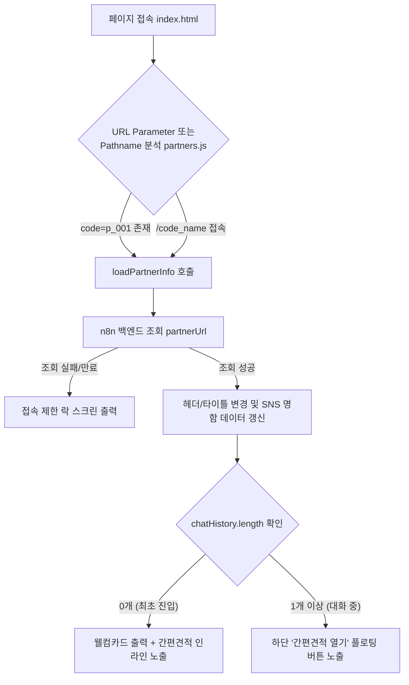

# 인테리어필름 1분견적 시스템 명세서 및 기능 점검표

이 문서는 **1분 간편견적 서비스**의 프론트엔드 아키텍처, 기능 구조, 상태 흐름을 정의하고 향후 소스코드 업데이트 시 기존 핵심 기능이 망가지지 않도록 자가 검증하기 위한 개발 체크리스트를 포함합니다.

---

## 1. 시스템 파일 구성 및 역할

| 파일명 | 경로 | 주요 역할 |
| :--- | :--- | :--- |
| **`index.html`** | `./index.html` | 채팅 화면 레이아웃 정의, 파일/카메라 인풋 노출 및 전송 바 구조 |
| **`index_app.js`** | `./index_app.js` | 가맹점 데이터 연동, 이미지 병합/압축, B2B 장바구니 계산, 전송 버퍼링 및 타이머 제어 |
| **`index_style.css`** | `./index_style.css` | 모바일 최적화 레이아웃, 글래스모피즘 오버레이, 박동(Pulse) 및 깜빡임 애니메이션 정의 |
| **`partners.js`** | `./partners.js` | URL 단축 경로(200 Rewrite 대응)와 가맹점 고유코드 간 매핑 데이터 보관 |
| **`견적모드_V2.json`** | `./견적모드_V2.json` | n8n 백엔드 워크플로우(Webhook 수신, 이미지 분석, 견적 계산) 백업 파일 (서버 이전 및 복구 시 n8n에서 Import) |
| **`_redirects`** | `./_redirects` | Netlify 호스팅 전용 리다이렉션 규칙 파일 (가맹점별 단축 주소 `/code` 접속 시 `index.html?code=xx`로 Rewrite) |

---

## 2. 핵심 기능 분석 및 데이터 흐름

### 2.1 가맹점 및 접속 제어 (`loadPartnerInfo`)
- **코드 자동 조회**: URL 쿼리 파라미터 `?code=p_xx` 혹은 `partners.js`에 정의된 `PARTNER_MAPPING` 경로를 매핑하여 가맹점 코드를 판별합니다.
- **백엔드 검증**: `CONFIG.partnerUrl`을 통해 가맹점 상태를 판별하며, 비활성화/기간 만료 시 연락처가 담긴 **접속 차단 락 스크린**을 표시해 접속을 통제합니다.

### 2.2 대화 내역 영구 보존 (`loadChatHistory`, `resetChat`)
- 사용자의 대화는 로컬스토리지 `v2_chat_history`에 실시간으로 세션 저장됩니다.
- 우측 상단의 새로고침 아이콘을 눌러 `resetChat`을 명시적으로 수동 실행(컨펌창 팝업)할 때만 초기화되어 재로드됩니다.

### 2.3 이미지 업로드 및 병합 압축 (`mergeImages`)
- **다중 이미지 병합**: 모바일 카메라 촬영 또는 갤러리에서 복수 선택된 이미지를 하나의 캔버스에 수직으로 자동 합성합니다.
- **용량 압축**: 로컬스토리지 초과 오류 방지를 위해 이미지 압축률 품질을 `0.5`로 낮춰 캐시 메모리 오버플로우를 예방합니다.

### 2.4 B2B 장바구니 및 드롭다운 모듈 (`renderModalBody`, `openDropdownForm`)
- **메인 탭 3개**: `🏠 평형별`, `🛒 품목별`, `📸 사진견적` 탭으로 이뤄진 UI를 그립니다.
- **세부 수량 옵션**: 품목 선택 시 `openDropdownForm` 모듈이 실행되어 문+틀 개수, 싱크대/신발장 미터 수(m)를 묻는 독립 폼이 오버레이 형태로 생성됩니다.
- **수량 제한**: AI 토큰 소모 최적화 및 봇 안정성을 위해 최대 7가지 품목 종류만 담기도록 제한(`addCartItem`)합니다.

### 2.5 스마트 전송 연동 및 예외 처리 (`sendRequest`)
- 사용자가 하단 입력창에 아무 텍스트도 적지 않은 채 **'전송'** 버튼을 누르더라도, **장바구니에 담긴 품목이 있다면 이를 텍스트로 합산하여 자동 전송**합니다.
- 사용자가 하단에 추가 메모를 쓴 채 전송을 누르면, **장바구니 품목과 메모를 결합하여 하나의 완성된 문장으로 치환 전송**합니다.
- 이벤트 바인딩 시 `MouseEvent`가 `isFromDynamicBtn` 매개변수로 잘못 침투하여 빈 전송을 일으키는 버그를 예방하기 위해 `isDynamic = (isFromDynamicBtn === true)` 판정을 수행합니다.

### 2.6 30초 카운트다운 로딩 화면 (`showFullscreenLoading`, `updateLoadingTimer`)
- 견적 계산이 진행되는 동안 화면 전체를 흐리게 블러 처리하는 **글래스모피즘 오버레이**를 띄웁니다.
- 중앙 타이머 서클 배경색은 매초 부드러운 파스텔톤 계열로 자동 교체됩니다.
- **0초 대기 효과**: 30초 카운트다운 완료 후에도 백엔드 응답이 지연되는 경우 `0초`로 고정되며 배경이 빨간색과 핑크색을 오가며 박동하듯 깜빡(`blinking-red`)입니다.

---

## 3. 업데이트 시 필수 검증 체크리스트

코드를 수정한 뒤 깃허브(GitHub)에 배포하기 전에 반드시 아래 기능들을 테스트하여 부작용(Side Effect)이 없는지 크로스 체크해야 합니다.

- [ ] **1. 가맹점 접속 잠금 기능**
  - 테스트 방법: URL에서 `?code=p_001`을 지우고 임의의 잘못된 가입 코드를 입력해 본 뒤, 접속 제한 경고창과 김정헌 실장 연락처 화면이 명확히 노출되는지 점검합니다.
- [ ] **2. 초기 화면 인라인 메뉴 배치**
  - 테스트 방법: 캐시를 완전히 비우고 접속했을 때, 웰컴 카드 아래에 간편견적 선택 UI가 팝업 모달이 아닌 **대화창 내에 자연스럽게 내장**되어 표기되는지 점검합니다.
- [ ] **3. 사진견적 탭 ReferenceError 자바스크립트 충돌 방지**
  - 테스트 방법: 간편견적 메뉴에서 `📸 사진견적` 탭을 선택했을 때, 화면이 하얗게 멈추지 않고 **보관된 사진 선택**과 **실시간 촬영하기** 버튼이 온전히 노출되는지 점검합니다.
- [ ] **4. 장바구니 뷰포트 고정 배지**
  - 테스트 방법: 품목을 한 개 장바구니에 추가했을 때 화면 우측 하단(전송 바 상단)에 빨간색 배지가 플로팅되는지 확인하고, 이를 눌렀을 때 최하단의 장바구니 리스트 위치로 **부드럽게 자동 스크롤**되는지 점검합니다.
- [ ] **5. 하단 전송 버튼 오작동 및 널(Null) 체크**
  - 테스트 방법:
    1. 아무것도 입력하지 않고 **전송** 버튼 클릭 시 ➔ 작동이 멈추거나 빈 말풍선이 가지 않고 무반응을 유지해야 합니다.
    2. 장바구니에 품목을 담고 텍스트 입력 없이 **전송** 버튼 클릭 ➔ 담긴 품목 정보가 자동으로 발송되며 로딩 창이 작동해야 합니다.
    3. 장바구니에 품목을 담고 텍스트 입력창에 메모를 쓰고 **전송** 버튼 클릭 ➔ 품목 리스트와 메모 내용이 병합되어 전송되는지 검증합니다.
- [ ] **6. 30초 카운트다운 전체화면 로딩 및 0초 깜빡임**
  - 테스트 방법: 전송을 눌렀을 때 화면 전체가 불투명하게 변하고 매초 타이머 서클의 색상이 정상 순환하는지 보고, 일부러 응답이 없는 상태를 재현(혹은 30초 이상 응답 지연)하여 `0초` 시점에 **빨간색 박동 효과**가 깜빡이는지 점검합니다.
- [ ] **7. 업데이트 꼬리표 텍스트 필터**
  - 테스트 방법: 견적 응답이 완료되었을 때 말풍선 내에 `[22:45 KST 업데이트]` 와 같은 지저분한 소괄호 정보가 나오지 않고 **`1분견적산출`** 텍스트만 깔끔하게 끊겨 나오는지 검증합니다.
- [ ] **8. 없는 항목(견적 불가 품목) 예외 안내 카드**
  - 테스트 방법: 필름 시공 불가 항목(예: 쇼파, 식탁 등)의 사진을 보내거나 텍스트로 보냈을 때, "⚠️ 견적 불가 또는 없는 항목 안내" 카드와 함께 가맹점의 담당자명, 연락처, SNS(블/인/카)가 담긴 명함 카드가 정상 출력되는지 검증합니다.
- [ ] **9. 중문짝 세부 품목 단가 매핑**
  - 테스트 방법: B2B 간편견적의 품목별 탭에서 `중문문짝만 시공`을 장바구니에 담아 전송했을 때, 단가 오류나 0원이 발생하지 않고 에어테이블 가격 데이터가 포함된 예상견적이 정상 산출되는지 확인합니다.
